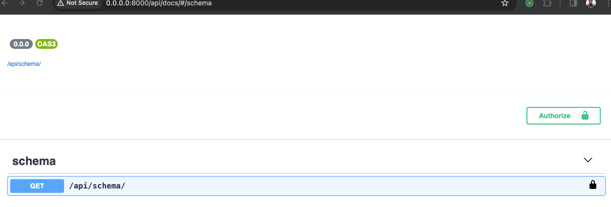

# Python-Django-RestAPI-Project
Create an Advanced REST API with Python, Django REST Framework and Docker using Test Driven Development(TDD)

## Project Description
- This project is a REST API for a recipe application where users can create, update, delete and view recipes.
- The project is built using Python, Django, Django REST Framework, Docker, Travis CI, postgresql, Heroku, AWS, Git, GitHub, Swagger.

## Project Features
- Users can create an account and login
- Users can create, update, delete and view recipes
- Users can upload recipe images
- Users can filter recipes by tags and ingredients
- Users can view recipe detail
- Users can add recipe tags
- Users can add recipe ingredients
- Users can view all tags
- Users can view all ingredients
- Users can view all recipes

## Image of the project


## Tools and Technology used to build the project and Project requirements
- Python
- Django
- Django REST Framework
- Docker
- Travis CI
- Postgresql
- Git & GitHub
- Swagger
- Heroku and AWS for deployment

## Live Demo
- The project is deployed on AWS and can be accessed via this [link](http://ec2-3-250-23-249.eu-west-1.compute.amazonaws.com/api/recipes/)
- The project is also deployed on Heroku and can be accessed via this [link](https://dansamuel-recipe-api.herokuapp.com/api/recipes/)

## Project Features and Steps towards Implementation
- Project planning and implementation of the project can be viewed on the [kanban board](https://github.com/users/DanSam5K/projects/11/views/2)
- Steps for implementing features and those already completed, also what stage the project is current at can also be viewed on the [kanban board](https://github.com/users/DanSam5K/projects/11/views/2)

## How to run the project locally
- Clone the project
- Create a virtual environment
- Install dependencies
- Must have docker installed on your machine you can find steps to follow to install docker [here](https://docs.docker.com/get-docker/)
- Run the project with docker and docker-compose

```
git clone
cd Python-Django-RestAPI-Project
python3 -m venv venv
source venv/bin/activate
pip install -r requirements.txt
docker-compose up -d --build
```
Visit docs url - http://localhost:8000/api/docs/ to view api endpoints locally

## Author: Daniel Samuel
- LinkedIn: [@dansamuel](https://www.linkedin.com/in/dansamuel/)

## Issues
- If you encounter any bugs or have any feature requests, please submit an issue with a description of what happened or your request

## Contributing
- Contributions are welcome, create a pull request!
- Feel free to fork this project and improve it

## License
- This project is open source and available under the [MIT License](LICENSE.md)
- Feel free to do whatever you want with it
- If you want to contribute to this project and make it better, your help is very welcome
